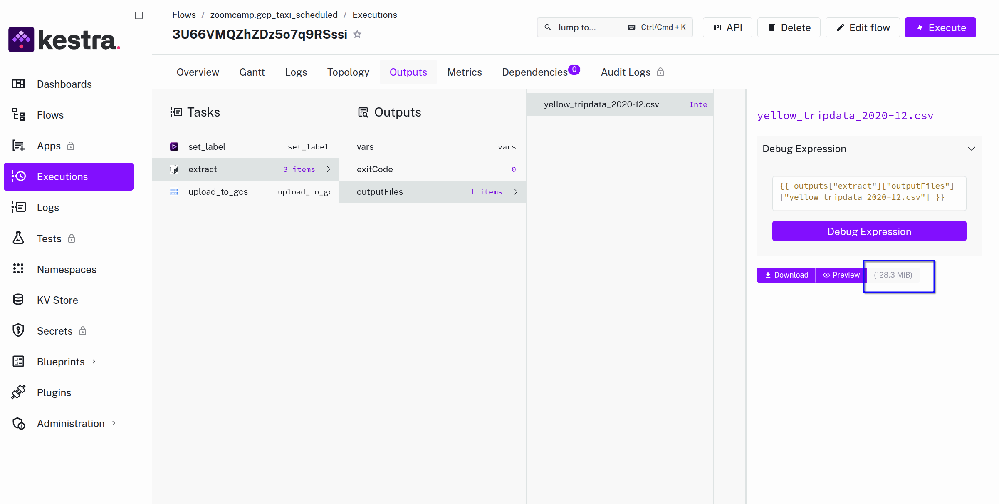
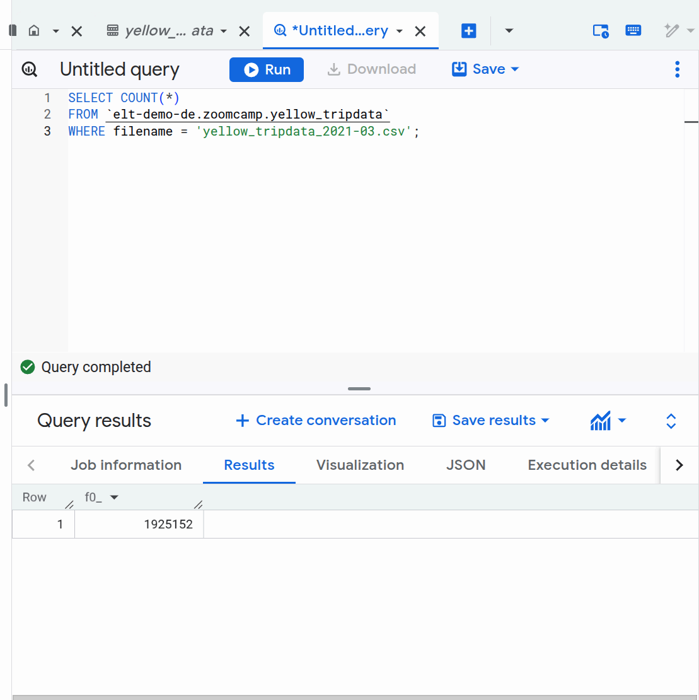

# Module 2 Homework - Workflow Orchestration with Kestra

## Assignment Overview

Extend the existing flows to include data for the year 2021 (January to July) for both Yellow and Green taxi data.

## How to Complete

### 1. Set up GCP credentials in Kestra KV Store

Run the `gcp_kv` flow to set up:
- `GCP_PROJECT_ID`
- `GCP_LOCATION`
- `GCP_BUCKET_NAME`
- `GCP_DATASET`
- `GCP_CREDS` (base64 encoded service account JSON)

### 2. Backfill 2020 data (for questions 3-4)

Use the **Backfill** feature in Kestra:
1. Go to the `gcp_taxi_scheduled` flow
2. Click on **Triggers** tab
3. Select the schedule trigger
4. Click **Backfill**
5. For Yellow: Select `2020-01-01 00:00:00` to `2020-12-31 23:59:59`
6. For Green: Select `2020-01-01 00:00:00` to `2020-12-31 23:59:59`
7. Run the backfill

### 3. Backfill 2021 data (main assignment)

Backfill for both taxi types from `2021-01-01` to `2021-07-31`.

---

## Quiz Answers

### Question 1
**Within the execution for Yellow Taxi data for year 2020 and month 12: what is the uncompressed file size?**

**Answer: 128.3 MiB**

Verification: 



---

### Question 2
**What is the rendered value of the variable `file` when inputs are: taxi=green, year=2020, month=04?**

**Answer: `green_tripdata_2020-04.csv`**

The variable definition:
```yaml
file: "{{ inputs.taxi }}_tripdata_{{ inputs.year }}-{{ inputs.month | numberFormat('00') }}.csv"
```

Renders to: `green_tripdata_2020-04.csv`

---

### Question 3
**How many rows for Yellow Taxi data for all CSV files in year 2020?**

**Answer: 24,648,499** (closest option to my result of 24,648,235)

The small difference is due to the MERGE deduplication which removes rows with identical key fields.

Query in BigQuery:
```sql
SELECT COUNT(*)
FROM `elt-demo-de.zoomcamp.yellow_tripdata`
WHERE EXTRACT(YEAR FROM tpep_pickup_datetime) = 2020;
```

---

### Question 4
**How many rows for Green Taxi data for all CSV files in year 2020?**

**Answer: 1,734,051** (closest option to my result of 1,733,999)

Query in BigQuery:
```sql
SELECT COUNT(*)
FROM `elt-demo-de.zoomcamp.green_tripdata`
WHERE EXTRACT(YEAR FROM lpep_pickup_datetime) = 2020;
```

---

### Question 5
**How many rows for Yellow Taxi data for March 2021 CSV file?**

**Answer: 1,925,152**

Query in BigQuery:
```sql
SELECT COUNT(*)
FROM `elt-demo-de.zoomcamp.yellow_tripdata`
WHERE filename = 'yellow_tripdata_2021-03.csv';
```


---

### Question 6
**How to configure timezone to New York in a Schedule trigger?**

**Answer: Add a `timezone` property set to `America/New_York` in the `Schedule` trigger configuration**

Example:
```yaml
triggers:
  - id: daily_schedule
    type: io.kestra.plugin.core.trigger.Schedule
    cron: "0 9 * * *"
    timezone: America/New_York
```

Kestra uses IANA timezone identifiers (like `America/New_York`), not abbreviations (EST) or UTC offsets (UTC-5).

---

## Flow Files

- `flows/gcp_taxi_scheduled.yaml` - Main ELT pipeline for loading taxi data to GCP (GCS + BigQuery)

## Docker Setup

The `docker-compose.yml` includes:
- PostgreSQL for local data storage
- pgAdmin for database management
- Kestra server with PostgreSQL backend

## Notes

- CSV data source: https://github.com/DataTalksClub/nyc-tlc-data/releases
- The 2021 data is only available from January to July
- Used the backfill feature to efficiently load historical data
